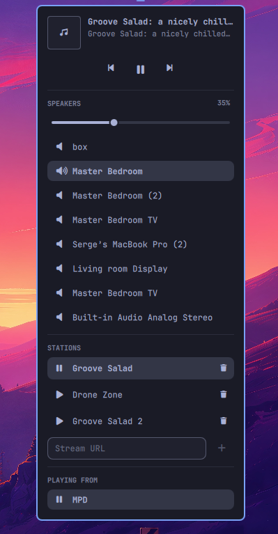

# Airwaves

An [Omarchy](https://omarchy.org/) shell bar widget for controlling
[OwnTone](https://owntone.github.io/owntone-server/): now playing, transport,
speaker routing (AirPlay 2, Chromecast, local audio) and a radio station list
you can add to and remove from.

A single music glyph sits in the bar. Clicking it opens a panel with everything
else, so the bar stays quiet.



## Why

PipeWire's RAOP support speaks AirPlay 1, which modern Apple receivers reject —
a HomePod answers `SETUP` with `500`, an Apple TV answers `OPTIONS` with `403`,
and on failure PipeWire destroys the sink so the device vanishes from every
audio menu. OwnTone implements AirPlay 2 properly, including device pairing.
Airwaves puts that in the bar.

## Requirements

- **Omarchy** with the Quattro shell (`omarchy plugin` commands available)
- **OwnTone**, reachable over HTTP (default `http://localhost:3689/api`)
- **[mpd-mpris](https://github.com/natsukagami/mpd-mpris)** — bridges OwnTone's
  MPD protocol (port 6600) to MPRIS, which supplies now-playing metadata and
  transport. Without it the panel still routes speakers and picks stations, but
  the transport buttons are disabled and no track is shown.

OwnTone restarts drop the MPD connection and kill `mpd-mpris`, whose packaged
unit is `Restart=on-failure` with a start limit — a few restarts leave it dead.
Recommended drop-in at `~/.config/systemd/user/mpd-mpris.service.d/restart.conf`:

```ini
[Unit]
StartLimitIntervalSec=0

[Service]
Restart=always
RestartSec=5
```

### AirPlay 2 pairing needs privileged ports

OwnTone must bind PTP ports 319/320 to negotiate AirPlay 2 timing. Running as
an unprivileged user without that capability, a HomePod gets through
`GET /info` and then times out at `SETUP (session)`. Grant it:

```ini
# /etc/systemd/system/owntone.service.d/ptp.conf
[Service]
AmbientCapabilities=CAP_NET_BIND_SERVICE
```

## Install

```bash
omarchy plugin add https://github.com/sergebelov/omarchy-airwaves.git --enable
```

Or clone into `~/.config/omarchy/plugins/io.github.sergebelov.airwaves/` and run
`omarchy plugin enable io.github.sergebelov.airwaves --section right`.

## Settings

Configurable per install from the bar settings UI, or in `shell.json`:

| Key | Default | What it does |
|---|---|---|
| `apiBase` | `http://localhost:3689/api` | OwnTone REST API base. Point at another host if OwnTone is remote. |
| `stationsPlaylist` | `radio` | Name of the OwnTone playlist holding your streams. Resolved by name — playlist ids differ per library. |
| `stationsFile` | `~/Music/radio.m3u` | The `.m3u` backing that playlist, written when adding or removing a station. |
| `pollIntervalSec` | `4` | How often the panel refreshes while open. Nothing polls while it is closed. |

## Usage

| Action | Result |
|---|---|
| Left click the icon | Open/close the panel |
| Right click | Play/pause |
| Middle click | Next |
| Scroll | Previous/next |
| Click a speaker | Toggle that output |
| Click a station | Play it (replaces the queue) |
| Trash button on a station | Remove it from the `.m3u` and rescan |
| Stream URL field | Play the URL now and append it to the `.m3u` |

A speaker needing AirPlay pairing shows a lock glyph; a PIN field appears while
any device is waiting. Enter the code the device displays.

## Notes

- Adding or removing a station triggers an OwnTone library rescan, which can
  take ~25 seconds. Rows update optimistically and reconcile when it finishes.
- `mpd-mpris` writes a zero-byte artwork file for streams without art, so the
  panel logs a benign `QQuickImage ... Cannot open` warning and shows a
  fallback glyph.

## License

MIT — see [LICENSE](LICENSE).
